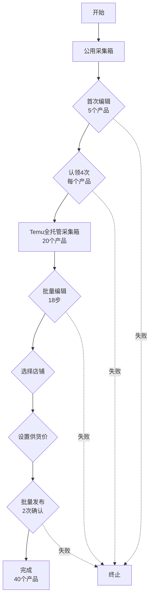

# 完整发布工作流程说明

## 📋 流程概览

完整的商品发布流程分为**4个阶段**，跨越**2个采集箱**：

```
公用采集箱 (首次编辑)  →  认领4次  →  Temu全托管采集箱 (批量编辑18步)  →  发布
    5个产品                  20个产品              20个产品                   40个产品
```

---

## 🔄 详细流程

### 阶段1️⃣：公用采集箱首次编辑（5个产品）

**位置**: `https://erp.91miaoshou.com/common_collect_box/items`

**操作步骤**：
1. 导航到公用采集箱
2. 切换到"全部"tab
3. 筛选创建人（可选）
4. 逐个编辑5个产品：
   - ✅ AI生成标题（添加型号后缀）
   - ✅ 核对商品类目
   - ✅ 删除不匹配的图片
   - ✅ 补充尺寸图和视频
   - ✅ 保存修改

**输入**: 5个采集的商品链接  
**输出**: 5个完成首次编辑的产品

---

### 阶段2️⃣：认领产品（5×4=20）

**位置**: 继续在公用采集箱

**操作步骤**：
1. 对每个产品点击"Temu全托管"认领按钮
2. 每个产品认领**4次**
3. 总计：5个产品 × 4次 = **20个产品副本**

**输入**: 5个已编辑的产品  
**输出**: 20个认领到Temu全托管采集箱的产品

**关键**: 认领后，产品自动进入 **Temu全托管采集箱**

---

### 阶段3️⃣：Temu全托管采集箱批量编辑（18步）

**位置**: `https://erp.91miaoshou.com/pddkj/collect_box/items`

**操作步骤**：
1. 导航到Temu全托管采集箱
2. 全选20个产品
3. 点击"批量编辑"按钮
4. 执行**18步批量编辑**（SOP步骤7.1-7.18）：

| 步骤 | 名称 | 操作 | 是否修改 |
|------|------|------|----------|
| 7.1 | 标题 | 预览+保存 | ❌ 不改动 |
| 7.2 | 英语标题 | 按空格键 | ✅ 修改 |
| 7.3 | 类目属性 | 补充属性 | ✅ 修改 |
| 7.4 | 主货号 | 预览+保存 | ❌ 不改动 |
| 7.5 | 外包装 | 长方体+硬包装 | ✅ 修改 |
| 7.6 | 产地 | 浙江 | ✅ 修改 |
| 7.7 | 定制品 | 预览+保存 | ❌ 不改动 |
| 7.8 | 敏感属性 | 预览+保存 | ❌ 不改动 |
| 7.9 | 重量 | 5000-9999G | ✅ 修改 |
| 7.10 | 尺寸 | 50-99cm（长>宽>高） | ✅ 修改 |
| 7.11 | 平台SKU | 自定义SKU编码 | ✅ 修改 |
| 7.12 | SKU分类 | 组合装500件 | ✅ 修改 |
| 7.13 | 尺码表 | 预览+保存 | ❌ 不改动 |
| 7.14 | 建议售价 | 成本价×10 | ✅ 修改 |
| 7.15 | 包装清单 | 预览+保存 | ❌ 不改动 |
| 7.16 | 轮播图 | 预览+保存 | ❌ 不改动 |
| 7.17 | 颜色图 | 预览+保存 | ❌ 不改动 |
| 7.18 | 产品说明书 | 上传文件 | ✅ 修改 |

**输入**: 20个认领后的产品  
**输出**: 20个完成批量编辑的产品

---

### 阶段4️⃣：选择店铺、设置供货价、批量发布

**位置**: 继续在Temu全托管采集箱

**操作步骤**：
1. **选择店铺**（SOP步骤8）
   - 全选20个产品
   - 点击"选择店铺"
   - 选择目标店铺
   - 确认

2. **设置供货价**（SOP步骤9）
   - 全选20个产品
   - 点击"设置供货价"
   - 输入供货价（真实供货价×3）
   - 确认

3. **批量发布**（SOP步骤10）
   - 点击"批量发布"按钮
   - **第1次确认**：确认发布
   - **第2次确认**：最终确认
   - 结果：20条 × 2次 = **40条产品**

**输入**: 20个完成批量编辑的产品  
**输出**: 40个已发布的产品（2次确认）

---

## 📊 流程数量关系

```
阶段1: 5个产品（首次编辑）
   ↓ 认领4次
阶段2: 20个产品（5×4）
   ↓ 批量编辑18步
阶段3: 20个产品（完成编辑）
   ↓ 发布2次确认
阶段4: 40个产品（5×4×2）
```

---

## 🎯 关键要点

### 两个不同的采集箱

1. **公用采集箱**（common_collect_box）
   - URL: `https://erp.91miaoshou.com/common_collect_box/items`
   - 用途：**首次编辑**
   - 操作：AI标题、类目、图片管理

2. **Temu全托管采集箱**（pddkj/collect_box）
   - URL: `https://erp.91miaoshou.com/pddkj/collect_box/items`
   - 用途：**批量编辑18步**
   - 操作：重量、尺寸、SKU、价格等

### 认领机制

- 在**公用采集箱**认领产品时，选择"Temu全托管"
- 认领后产品自动进入**Temu全托管采集箱**
- 每个产品认领4次，生成4个副本（共20个）

### 发布机制

- 批量编辑完成后，在**Temu全托管采集箱**中发布
- 需要2次确认：第1次点击"批量发布"，第2次确认
- 最终生成：20条×2次 = 40条产品

---

## 💻 使用方法

### 方式1：使用完整工作流控制器

```python
from src.workflows.complete_publish_workflow import CompletePublishWorkflow

# 初始化并执行。内部会自动登录妙手ERP并依次完成4个阶段。
workflow = CompletePublishWorkflow(use_ai_titles=True)
result = workflow.execute()

print(result.to_dict())
```

### 方式2：运行测试脚本

```bash
cd apps/temu-auto-publish

# 测试完整工作流
uv run python scripts/test_complete_workflow.py
```

---

## 📁 相关文件

### 核心控制器
- `src/browser/first_edit_controller.py` - 首次编辑控制器
- `src/browser/batch_edit_controller_v2.py` - 批量编辑控制器（改进版）
- `src/workflows/complete_publish_workflow.py` - 最新完整工作流控制器（同步入口）
- `src/workflows/legacy/` - 历史版本归档（v1/v2）

### 配置文件
- `config/miaoshou_selectors_v2.json` - 选择器配置
- 包含公用采集箱和Temu全托管采集箱的选择器

### 测试脚本 / 运行入口
- `main.py` - 最简执行入口 (`python main.py`)
- `scripts/test_complete_workflow.py` - 完整工作流测试
- `scripts/test_batch_edit_v2.py` - 批量编辑18步测试
- `scripts/verify_batch_edit.py` - 单个产品验证

---

## ⚠️ 注意事项

1. **顺序不能颠倒**
   - 必须先在公用采集箱首次编辑
   - 然后认领到Temu全托管采集箱
   - 最后在Temu全托管采集箱进行批量编辑和发布

2. **数量要求**
   - 首次编辑：5个产品
   - 认领次数：每个产品4次
   - 批量编辑：20个产品（自动计算）
   - 发布：2次确认

3. **选择器维护**
   - 如果妙手ERP界面更新，需要更新选择器配置
   - 使用Playwright Codegen录制新的选择器

4. **错误处理**
   - 每个阶段都有独立的错误处理
   - 如果某阶段失败，会终止流程并返回错误信息
   - 建议先小批量测试（1-2个产品）

---

## 🔄 工作流状态图



---

**文档版本**: v2.0  
**更新日期**: 2025-11-03  
**状态**: ✅ 已实现并测试

