# 商品发布SOP - IT专用

> 妙手ERP发布商品完整操作流程

---

## 📋 目录

1. [访问前端店铺](#1-访问前端店铺)
2. [结合选品表，站内搜索同款商品](#2-结合选品表站内搜索同款商品)
3. [一次性采集5个同款商品链接](#3-一次性采集5个同款商品链接)
4. [妙手公共采集箱首次编辑](#4-妙手公共采集箱首次编辑)
5. [5条链接各认领4次](#5-5条链接各认领4次)
6. [在采集箱中检查是否认领成功](#6-在采集箱中检查是否认领成功)
7. [采集箱进行二次编辑（批量编辑18步）](#7-采集箱进行二次编辑批量编辑18步)
8. [选择店铺](#8-选择店铺)
9. [设置供货价](#9-设置供货价)
10. [批量发布](#10-批量发布)
11. [查看发布情况](#11-查看发布情况)

---

## 1. 访问前端店铺

登录Temu商家后台，在首页点击**「一键访问店铺」**。


---

## 2. 结合选品表，站内搜索同款商品

### 📊 选品表

**选品表：** 选品表-it测试版

**选品表Excel结构：**
- **主品负责人**：负责该产品的人员
- **产品名称**：商品的基本名称
- **标题后缀**：型号编号（如：A0001型号、A0049型号）
- **产品颜色/规格**：可售的颜色和规格信息
- **产品图**：主图展示
- **尺寸图（用于参考尺寸列为准）**：标准尺寸参考

### 🔍 操作步骤

#### 步骤1：仔细阅读选品表

以"**药箱收纳盒**"这个产品为例：
- 仔细阅读选品表中该产品的规格
  - 可售颜色
  - 尺寸
  - 具体展示形象等
- **记下型号编号**（后续标题需要添加，如：A0049型号）

#### 步骤2：站内搜索产品

- 站内搜索产品名
- 仔细筛选符合要求的同款商品
- **搜索框位置**：Temu前端顶部中间位置


#### 🎯 搜索技巧

1. **使用精准关键词**：直接使用选品表中的产品名称
2. **多翻几页**：不要只看第一页，符合要求的商品可能在后面
3. **对比规格**：每个商品都要仔细对比尺寸、颜色、外观

### ⚠️ 常见错误案例

> **注意：以下是两个错误案例，务必避免！**

#### ❌ 错误案例①：搜索出的产品尺寸不一致


#### ❌ 错误案例②：搜索出的产品长得不一样

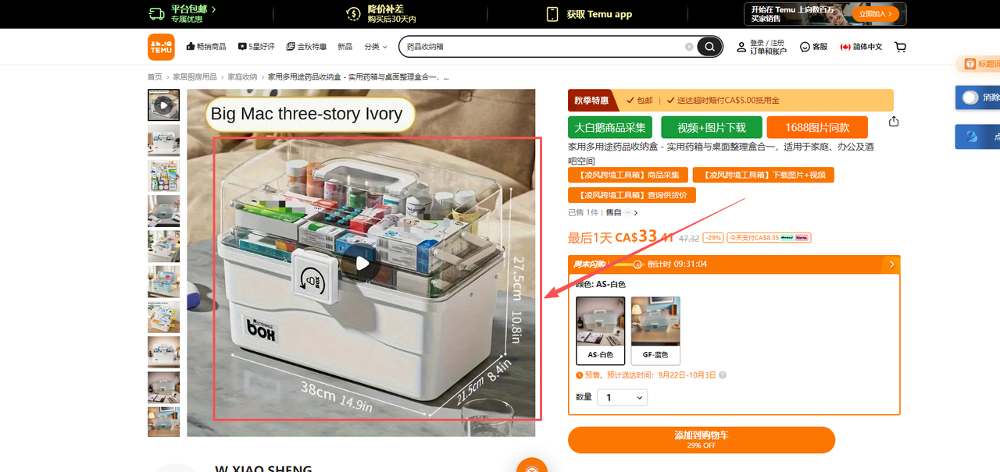

### 🔴 重要提示

**出现以上类似情况，链接在采集了之后，必须要在妙手中将不匹配的图片删除替换！**

---

## 3. 一次性采集5个同款商品链接

### 📋 采集要求

**采集数量：** 必须采集 **5个** 符合要求的同款商品链接

### ✅ 采集标准

在采集前，每个商品必须确认：
1. **尺寸一致**：与选品表中的尺寸规格完全匹配
2. **外观相似**：产品整体外观、形状、设计相似
3. **颜色匹配**：颜色选项与选品表要求一致
4. **质量可靠**：优先选择评分高、销量好的商品

### 🔄 采集方法

#### 方式1：使用妙手浏览器插件（推荐）
1. 在Temu商品详情页，点击妙手插件的"采集商品"按钮
2. 商品会自动添加到妙手公用采集箱

#### 方式2：手动复制链接
1. 复制商品详情页的URL
2. 在妙手ERP中手动导入

### ⚠️ 采集注意事项

1. **必须完全符合选品表要求**：不符合的商品即使很相似也不要采集
2. **采集顺序无关紧要**：不需要按特定顺序采集
3. **检查采集结果**：采集后立即在妙手采集箱中确认是否成功
4. **避免重复采集**：同一个商品不要采集多次

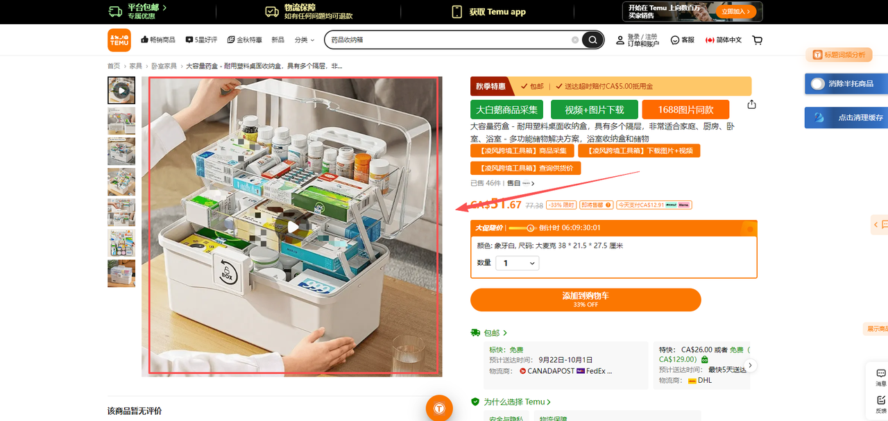

---

## 4. 妙手公共采集箱首次编辑

### 🎯 筛选和查找采集的商品

#### 步骤0：进入公用采集箱并筛选

1. **导航路径**：通用功能 → 产品采集 → **公用采集箱**
2. **筛选人员**：
   - 在"创建人员"下拉框中选择自己的名字（如：柯诗俊(keshijun123)）
   - 点击"搜索"按钮
3. **切换Tab**：点击"**全部**"tab，查看所有采集的商品
4. **确认数量**：应该能看到刚才采集的5条新链接

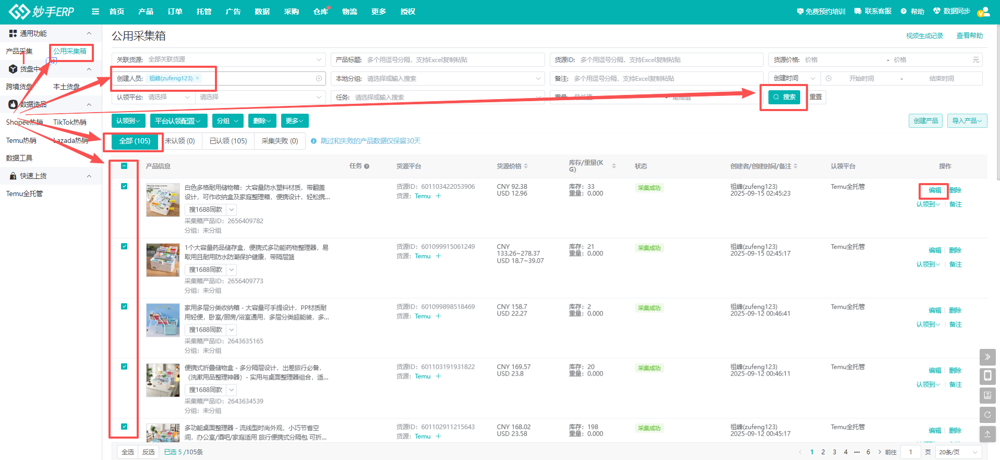

### 4.1 选择商品进行首次编辑

在妙手公共采集箱中，找到刚才采集的**5条新链接**，选中后进行首次编辑。

**操作步骤：**
1. **勾选商品**：在商品列表左侧勾选框中，选中要编辑的商品
2. **点击编辑**：点击商品行右侧的"编辑"按钮
3. **等待弹窗**：编辑弹窗会在页面中央打开


### 4.2 修改标题 - 用AI重新生成5个新的产品标题


#### 📝 操作步骤

**① 准备AI提示词**

先将原商品标题依次复制，最后配上提示词：

```
提取上面5个商品标题中的高频热搜词，写5个新的中文标题，
不要出现药品，急救等医疗相关的词汇
符合欧美人的阅读习惯，符合TEMU/亚马逊平台规则，提高搜索流量
```

**② 替换标题并添加修饰词**

生成后依次复制替换原标题，可在标题最后部分加上修饰词：

- **🔴 必须加！** 该品对应的型号，例如：**A0001型号**
- 其他可选修饰词：
  - `/2025新款`
  - `/适用于456种场景`
  - `/节日必备`
  - 等


### 4.3 核对采集商品的类目


**⚠️ 注意事项：**
- 有些类目目前我们上不了，例如：**药品**、**电子**等
- 后续会完善上不了的类目名称
- **目前遇到不确定的必须要问组长！**

### 4.4 核对原商品链接头图/轮播图/sku图


#### 🍞 核心操作

**将不一致的产品图全部删除/替换，坚决不允许遗漏！**

**注意：** sku图片后续全部换成实拍图！！！

#### 🔍 图片核对详细步骤

1. **进入产品图片管理**：
   - 在编辑弹窗中找到"产品图片"标签页
   - 可以看到头图、轮播图、SKU图三个区域

2. **对比选品表**：
   - 打开选品表对应的产品
   - 仔细对比颜色、尺寸、外观

3. **删除不匹配图片**：
   - 鼠标悬停在不匹配的图片上
   - 点击删除按钮（通常是×或垃圾桶图标）
   - **常见不匹配情况**：
     - 颜色不符（如选品表要求白色，但图片是蓝色）
     - 尺寸不对（如选品表要求大号，但图片是小号）
     - 外观差异（形状、设计明显不同）

4. **确认保留图片**：
   - 确保保留的图片都与选品表规格一致
   - 每个SKU至少保留1张图片

#### ⚠️ 图片核对注意事项

- **宁可删多不可删少**：有疑问的图片也要删除
- **不要遗漏SKU图**：SKU图是最容易忽略的
- **颜色匹配优先**：颜色不对的图片必须删除

### 4.5 补充尺寸图和产品视频

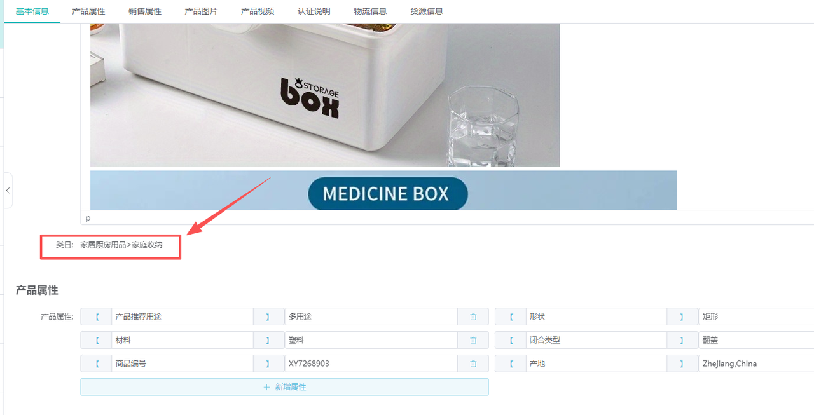

#### 📷 操作步骤

**① 复制图片/视频地址**

1. 先在站内找到之前采集的5个商品链接
2. 找到所需并且和选品表中规格一致的尺寸图和视频
3. 鼠标选中，右击复制对应的图片/视频地址

**② 上传到妙手**

1. 在妙手的对应入口，选择「**使用网络图片**」（红框标注的按钮）
2. 依次复制图片/视频地址上传

#### 🎯 补充图片/视频的标准

1. **尺寸图要求**：
   - 必须清晰显示产品尺寸标注
   - 尺寸数据与选品表一致
   - 图片格式：JPG、JPEG、PNG
   - 图片大小：不超过3MB

2. **产品视频要求**：
   - 展示产品使用场景
   - 时长：建议不超过60秒
   - 格式：MP4（推荐）
   - 大小：不超过100MB

#### ⚠️ 注意事项

- **使用网络图片功能**：不要手动下载再上传，直接使用网络图片URL更快捷
- **图片来源**：必须从之前采集的5个商品链接中复制
- **规格一致性**：确保补充的图片与选品表规格完全一致

### 4.6 继续操作剩余链接

保存修改此条链接，**继续操作剩余4条**。

#### 🔄 循环操作流程

**逐个编辑5条链接**，每条链接都要完成以下步骤：
1. ✅ 修改标题（AI生成 + 型号后缀）
2. ✅ 核对类目
3. ✅ 删除不匹配图片
4. ✅ 补充尺寸图/视频
5. ✅ 保存修改
6. ✅ **关闭编辑弹窗**（点击右上角×）

#### ⚠️ 保存注意事项

1. **必须保存成功**：
   - 点击"保存"按钮后等待提示
   - 看到"保存成功"提示才算完成
   - 如果保存失败，检查必填项是否遗漏

2. **必须关闭弹窗**：
   - 保存后，编辑弹窗不会自动关闭
   - 必须手动点击右上角的×关闭
   - 否则会影响下一个商品的编辑

3. **进度跟踪**：
   - 建议在纸上或备忘录中记录进度
   - 格式：✓ 药箱收纳盒-1、✓ 药箱收纳盒-2...
   - 避免遗漏或重复

---

## 5. 5条链接各认领4次

采集的5条链接全部首次修改完成后，挨个点击**「认领」4次**。


**结果：** 5条链接 × 4次认领 = **20条产品**

### 🎯 认领操作详细步骤

1. **返回采集箱列表**：
   - 关闭所有编辑弹窗
   - 确保在公用采集箱的商品列表页面

2. **找到第1条链接**：
   - 在列表中找到第1个已编辑的商品
   - 确认是刚才编辑过的商品（标题应该有型号后缀）

3. **点击认领按钮**：
   - 点击商品行右侧的"**Temu全托管**"按钮（或"认领"按钮）
   - 弹出确认对话框，点击确认

4. **重复认领3次**：
   - 再点击3次"认领"按钮
   - 每次都要等待认领成功提示
   - 共计4次认领

5. **继续下一条链接**：
   - 找到第2条链接
   - 重复步骤3-4
   - 直到5条链接全部认领完成

### ⏱️ 认领时间控制

- **每次认领间隔**：建议间隔1-2秒
- **总时间**：约2-3分钟完成全部认领
- **避免过快**：连续点击太快可能导致认领失败

### ✅ 认领成功验证

认领成功的标志：
1. 页面显示"认领成功"提示
2. 商品状态变为"已认领"
3. 认领计数增加

### ⚠️ 认领常见问题

**Q: 认领按钮点不了/灰色？**
A: 可能原因：
- 商品尚未保存首次编辑
- 网络延迟，稍等片刻重试
- 浏览器需要刷新

**Q: 认领失败怎么办？**
A: 解决方法：
- 刷新页面重新认领
- 检查商品状态是否正常
- 联系组长协助

---

## 6. 在采集箱中检查是否认领成功


### ✅ 验证步骤

1. 右下角选中「**20条/页**」
2. 依次翻动本页查看
3. 确认刚才那5条链接是否全部出现
4. **✓ 正确情况：** 每条链接会有**4个副本**

---

## 7. 采集箱进行二次编辑（批量编辑18步）

检查完毕确认无误后，**全选中本页20条链接**，点击「**批量编辑**」。


### 🎯 批量编辑操作总则

#### 操作流程（每一步都要遵循）

1. **进入步骤**：点击左侧导航栏的步骤名称
2. **填写内容**：根据要求填写或选择内容
3. **点击预览**：先点击"预览"按钮，检查修改效果
4. **保存修改**：确认无误后，点击"保存修改"按钮
5. **等待成功**：等待页面显示"已选择 20 个产品，取消，翻译，保存修改"
6. **查看进度**：观察保存进度提示，确保全部成功
7. **进入下一步**：点击左侧下一个步骤

#### ⚠️ 批量编辑关键注意事项

1. **必须先预览再保存**：
   - 不可跳过预览步骤
   - 预览可以发现填写错误
   - 保存前最后的确认机会

2. **保存失败处理**：
   - 如果显示保存失败，**不要**直接进入下一步
   - 返回检查必填项是否遗漏
   - 常见原因：类目属性未补全

3. **20个产品全选**：
   - 确保页面显示"已选择 20 个产品"
   - 如果数量不对，返回列表重新选择

4. **不要刷新页面**：
   - 批量编辑过程中不要刷新浏览器
   - 否则可能丢失已保存的修改

5. **按顺序操作**：
   - 严格按照1-18的顺序
   - 不要跳步或乱序

---

### 📋 批量编辑18步清单

以下是18个步骤的快速参考（详细说明见各子章节）：

| 步骤 | 名称 | 是否需要修改 | 关键操作 |
|------|------|-------------|----------|
| 7.1  | 标题 | ❌ 不改动 | 预览→保存 |
| 7.2  | 英语标题 | ✅ 按空格 | 按空格→预览→保存 |
| 7.3  | 类目属性 | ✅ 必填 | 参考采集链接填写 |
| 7.4  | 主货号 | ❌ 不改动 | 预览→保存 |
| 7.5  | 外包装 | ✅ 必填 | 长方体+硬包装 |
| 7.6  | 产地 | ✅ 必填 | 浙江 |
| 7.7  | 定制品 | ❌ 不改动 | 预览→保存 |
| 7.8  | 敏感属性 | ❌ 不改动 | 预览→保存 |
| 7.9  | 重量 | ✅ 必填 | 5000-9999G |
| 7.10 | 尺寸 | ✅ 必填 | 50-99cm（长>宽>高）|
| 7.11 | 平台SKU | ✅ 必填 | 自定义SKU编码 |
| 7.12 | SKU分类 | ✅ 必填 | 组合装500件 |
| 7.13 | 尺码表 | ❌ 不改动 | 不用修改 |
| 7.14 | 建议售价 | ✅ 建议填 | 成本价×10 |
| 7.15 | 包装清单 | ❌ 不改动 | 预览→保存 |
| 7.16 | 轮播图 | ❌ 不改动 | 暂时不需要 |
| 7.17 | 颜色图 | ❌ 不改动 | 不需要 |
| 7.18 | 产品说明书 | ✅ 必填 | 上传文件 |

---

### 7.1 修改标题

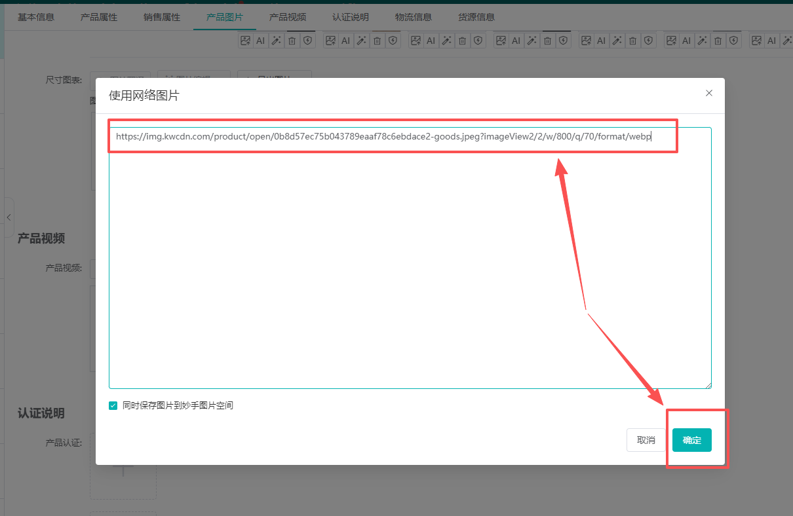

- ✅ **不需要改动**
- 先点击「预览」
- 再点击「保存修改」

> **说明：** 保存修改后会有保存进度，显示成功则进入下一项，不成功再看具体原因。

---

### 7.2 修改英语标题

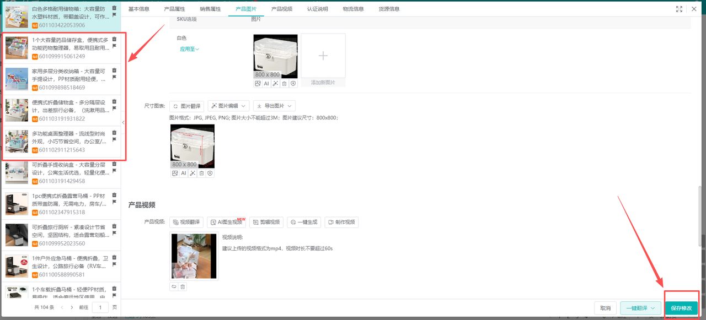

- 在「使用新英语标题」框内
- 按一下**空格键**（不需要打字）
- 先预览后保存

---

### 7.3 修改类目属性 ⚠️


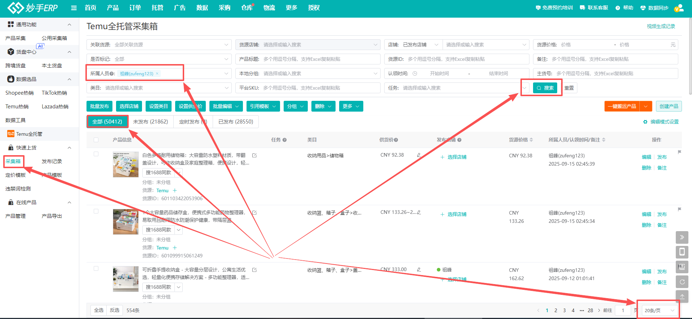

#### 📋 操作步骤

1. 点击需要修改的类目旁的**展开按键**（红色框）
2. 在采集的商品链接中找到**同一类目**（红色框）
3. 参考采集链接的类目属性（蓝色框）
4. 依次补充需要修改的类目属性（蓝色框）
5. 先预览再保存

**⚠️ 重要：** 如果出现保存失败的情况，就是遗漏了需要补充的类目属性，返回去重新检查核对。

---

### 7.4 修改主货号


- ✅ **不需要改动**
- 先预览后保存

---

### 7.5 修改外包装


#### 📦 填写内容

- **外包装形状：** 长方体
- **外包装类型：** 硬包装
- **添加图片**
- 依次选中，先预览后保存

---

### 7.6 修改产地

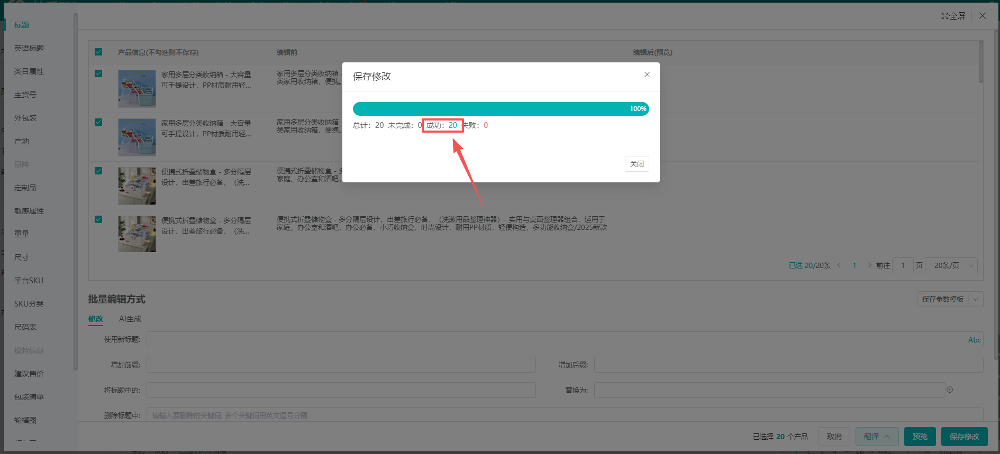

#### 🌏 填写内容

- 产地输入「**浙江**」
- 选中「**中国大陆/浙江省**」
- 先预览后保存

---

### 7.7 修改定制品


- ✅ **不需要改动**
- 先预览后保存

---

### 7.8 修改敏感属性


- ✅ **不需要改动**
- 先预览后保存

---

### 7.9 修改重量


#### ⚖️ 填写规则

- **使用新重量：** **5000-9999G** 之间随便填
- 先预览，再保存

---

### 7.10 修改尺寸

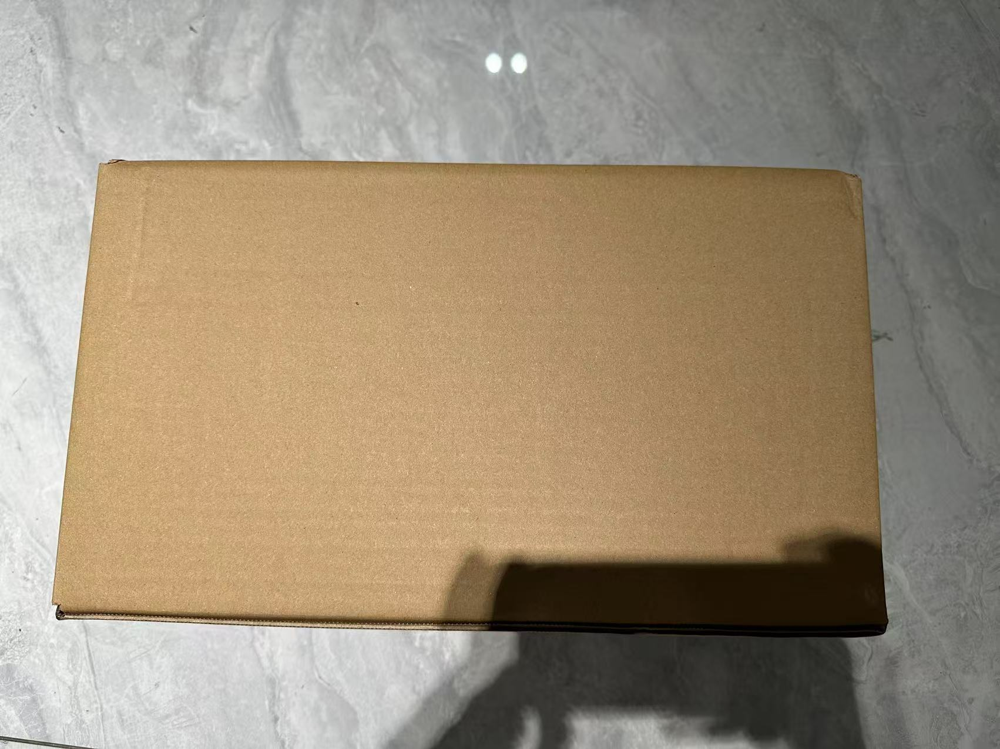

#### 📐 填写规则

- 长宽高在 **50-99cm** 以内随便填
- **⚠️ 重要：长 ＞ 宽 ＞ 高**
- 先预览后保存

**示例：** 长=80cm，宽=60cm，高=50cm ✓

#### ✅ 正确示例

```
✓ 长=89cm，宽=64cm，高=32cm  （89 > 64 > 32）
✓ 长=75cm，宽=55cm，高=50cm  （75 > 55 > 50）
✓ 长=99cm，宽=88cm，高=77cm  （99 > 88 > 77）
```

#### ❌ 错误示例

```
✗ 长=50cm，宽=60cm，高=70cm  （50 < 60，不符合长>宽）
✗ 长=80cm，宽=50cm，高=65cm  （50 < 65，不符合宽>高）
✗ 长=45cm，宽=30cm，高=20cm  （45 < 50，不在范围内）
```

#### 🎯 填写技巧

1. **快速生成尺寸**：
   - 长度：随机选 80-99cm
   - 宽度：比长度小10-20cm
   - 高度：比宽度小10-20cm

2. **检查方法**：
   - 填写后立即检查：长 > 宽 > 高
   - 如果不符合，重新调整数字

3. **常用尺寸组合**（可直接使用）：
   - 89, 64, 32
   - 87, 54, 34
   - 80, 60, 50
   - 75, 55, 45

---

### 7.11 修改平台SKU

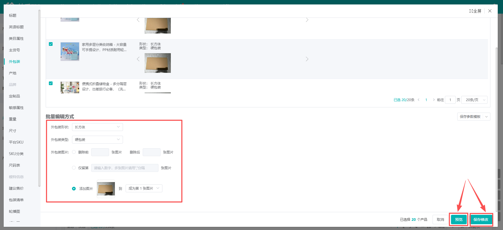

- 先点击「**自定义SKU编码**」
- **不需要填写**
- 再依次点击预览和保存修改

---

### 7.12 修改SKU分类

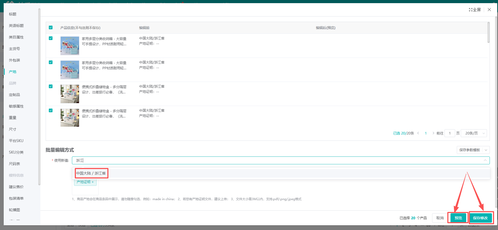

#### 📦 选择选项

- 选择「**组合装500件**」
- ❌ **不是独立包装**

---

### 7.13 尺码表

- ✅ **不用修改**

---

### 7.14 修改建议售价

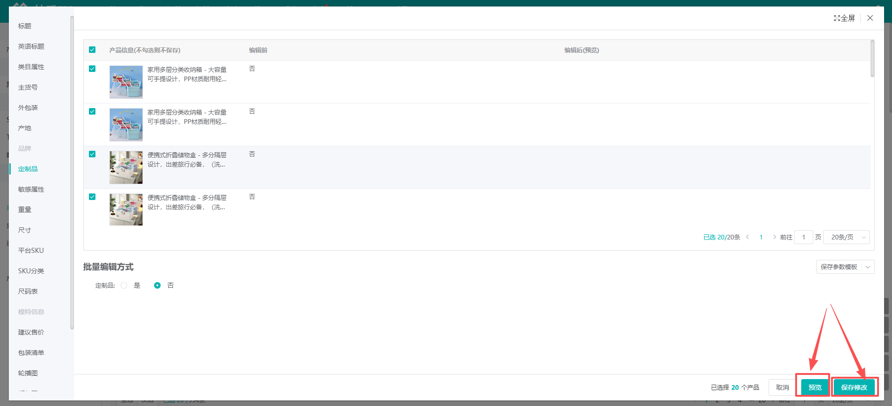

#### 💰 填写规则

- 一般填 **商品成本价的十倍**
- 不做要求随便填

---

### 7.15 修改包装清单


- ✅ **不需要改动**
- 先预览后保存

---

### 7.16 轮播图

- ✅ **暂时不需要修改**

---

### 7.17 颜色图/预览图

- ✅ **不需要修改**

---

### 7.18 修改产品说明书


- **上传文件**

**🎉 至此二次编辑全部修改完毕，进入下一项！**

---

## 8. 选择店铺

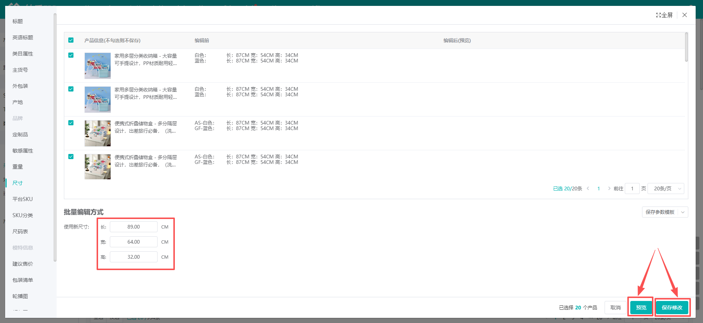

### 🏪 操作步骤

1. **全选中** 二次编辑完成的20条链接
2. 依次点击「**选择店铺**」
3. 选择自己所属的店铺
4. 点击「确定」

---

## 9. 设置供货价

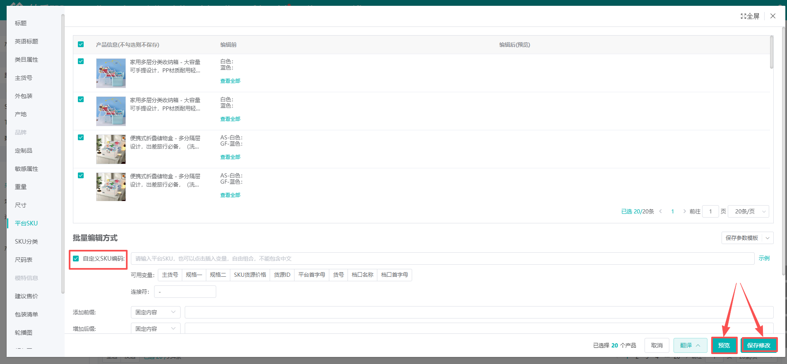

### 💵 操作步骤

1. **全选中** 二次编辑完成的20条链接
2. 依次点击「**设置供货价**」
3. 设置为 **真实供货价的3倍**
4. 点击「确定」

### 📊 价格计算规则

**真实供货价 = 商品采购成本价 × (2.5 ~ 3)**

**妙手供货价 = 真实供货价 × 3**

**⚠️ 注意：** 最低不能低于成本价的2.5倍！

---

## 10. 批量发布

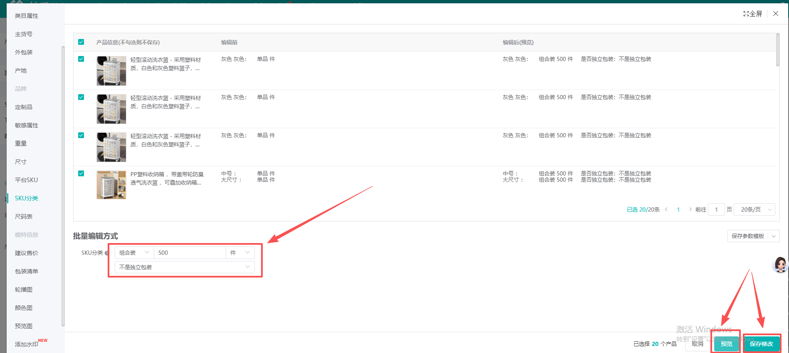

### 🚀 操作步骤

1. 点击「**批量发布**」
2. 需要依次点击 **2次确认发布**

### 📈 发布数量

**20条链接 × 2次发布 = 40条产品**

---

## 11. 查看发布情况

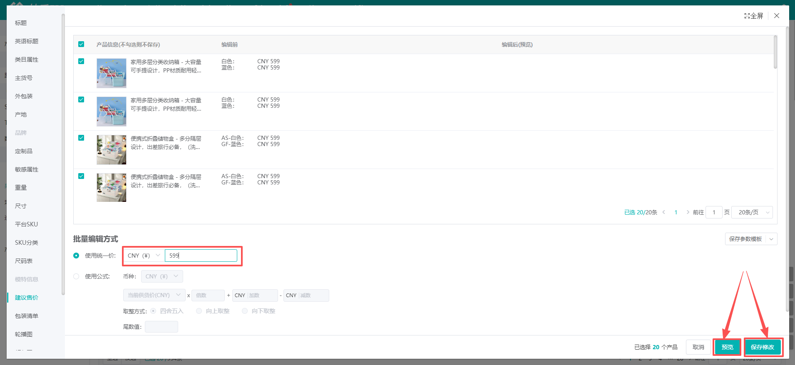

### 📊 操作步骤

1. 点击「**发布记录**」
2. 选择自己的店铺
3. 查看刚才发布的链接

### ✅ 正常情况

- 可以发布成功 **50-100条链接**
- 如果发布失败率过低，需要查看失败原因
- 如果不是常见原因（如图所示），**及时反馈给小组长**


---

## ✅ 流程完成

**🎉 至此妙手发布商品流程操作完毕！**

---

## 📌 重要提示汇总

### 🔴 必做项

1. ✅ 标题必须添加型号后缀（如：A0001型号）
2. ✅ 删除所有不匹配的产品图片
3. ✅ SKU图片后续全部换成实拍图
4. ✅ 认领必须4次（5条×4次=20条）
5. ✅ 批量编辑必须完成全部18步
6. ✅ 每步必须先预览再保存
7. ✅ 保存成功后才能进入下一步

### ⚠️ 注意事项

1. 遇到不确定的类目，必须问组长
2. 类目属性如果保存失败，检查是否遗漏
3. 尺寸必须满足：长 ＞ 宽 ＞ 高
4. 供货价不能低于成本价的2.5倍
5. 发布失败率过高要及时反馈
6. 保存后必须手动关闭编辑弹窗（点击×）
7. 批量编辑过程中不要刷新页面
8. 人员筛选：在采集箱中必须先筛选自己的名字

### 🎯 数据填写快速参考

#### 价格计算
```
真实供货价 = 成本价 × (2.5 ~ 3)
妙手供货价 = 真实供货价 × 3
建议售价 = 成本价 × 10
```

#### 重量和尺寸
```
重量：5000-9999G（随机）
长度：80-99cm
宽度：比长度小10-20cm
高度：比宽度小10-20cm
规则：长 > 宽 > 高
```

#### 外包装
```
形状：长方体
类型：硬包装
图片：必须上传
```

#### 产地
```
固定填写：浙江
选择：中国大陆/浙江省
```

#### SKU分类
```
固定选择：组合装500件
不是独立包装
```

### 📋 快速检查清单

- [ ] 采集5个同款链接
- [ ] 首次编辑（AI生成标题+型号）
- [ ] 删除不匹配图片
- [ ] 补充尺寸图/视频
- [ ] 每条认领4次（共20条）
- [ ] 检查认领成功（20条/页）
- [ ] 批量编辑18步全部完成：
  - [ ] 7.1 标题 ✓
  - [ ] 7.2 英语标题（按空格）✓
  - [ ] 7.3 类目属性 ✓
  - [ ] 7.4 主货号 ✓
  - [ ] 7.5 外包装 ✓
  - [ ] 7.6 产地 ✓
  - [ ] 7.7 定制品 ✓
  - [ ] 7.8 敏感属性 ✓
  - [ ] 7.9 重量 ✓
  - [ ] 7.10 尺寸 ✓
  - [ ] 7.11 平台SKU ✓
  - [ ] 7.12 SKU分类 ✓
  - [ ] 7.13 尺码表 ✓
  - [ ] 7.14 建议售价 ✓
  - [ ] 7.15 包装清单 ✓
  - [ ] 7.16 轮播图 ✓
  - [ ] 7.17 颜色图 ✓
  - [ ] 7.18 产品说明书 ✓
- [ ] 选择店铺
- [ ] 设置供货价
- [ ] 批量发布（2次确认）
- [ ] 查看发布记录

### 🚨 常见错误和解决方法

| 错误情况 | 原因 | 解决方法 |
|----------|------|----------|
| 保存失败 | 必填项未填写 | 检查类目属性、外包装等必填项 |
| 找不到商品 | 未筛选人员 | 在"创建人员"中选择自己的名字 |
| 认领失败 | 网络延迟或商品状态异常 | 刷新页面重试，或联系组长 |
| 弹窗关不掉 | 未点击×按钮 | 手动点击右上角的×关闭 |
| 尺寸保存失败 | 不符合长>宽>高规则 | 重新填写，确保符合规则 |
| 图片上传失败 | 图片过大或格式不对 | 使用网络图片URL，不要本地上传 |
| 找不到20个产品 | 认领次数不够 | 每条链接必须认领4次 |

### 💡 效率提升技巧

1. **准备工作**：
   - 先准备好AI标题生成提示词
   - 记下选品表的型号（如：A0049型号）
   - 准备好常用尺寸数据

2. **批量操作**：
   - 可以先把AI生成的5个标题复制到记事本
   - 逐个粘贴比临时生成更快

3. **进度跟踪**：
   - 使用纸笔或电子表格记录进度
   - 标记已完成的步骤，避免遗漏

4. **快捷键**：
   - Ctrl+C / Cmd+C: 复制
   - Ctrl+V / Cmd+V: 粘贴
   - F5: 刷新页面（慎用！）

---

## 📝 附注

- **文档版本：** IT专用测试版
- **更新日期：** 2025-10-30
- **如遇问题：** 及时联系小组长
- **操作原则：** 严格按照步骤执行，确保每一步都正确完成

---

**文档结束**
